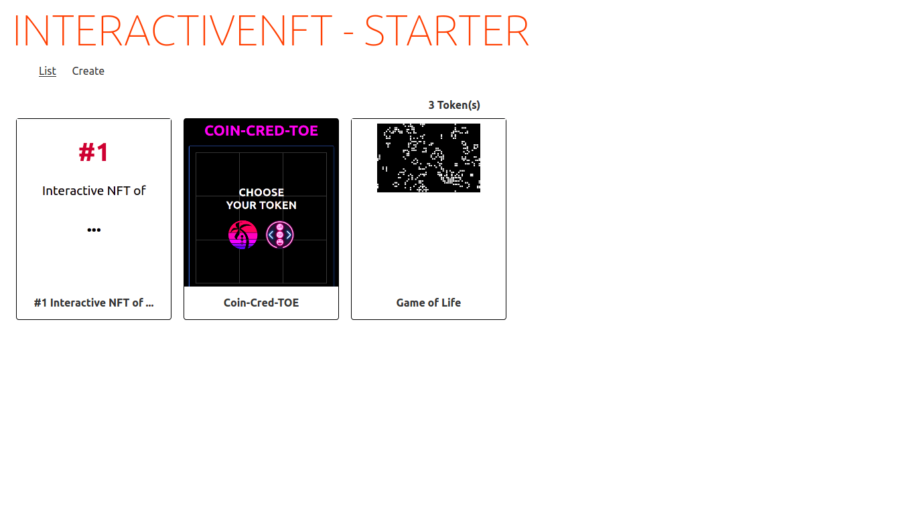
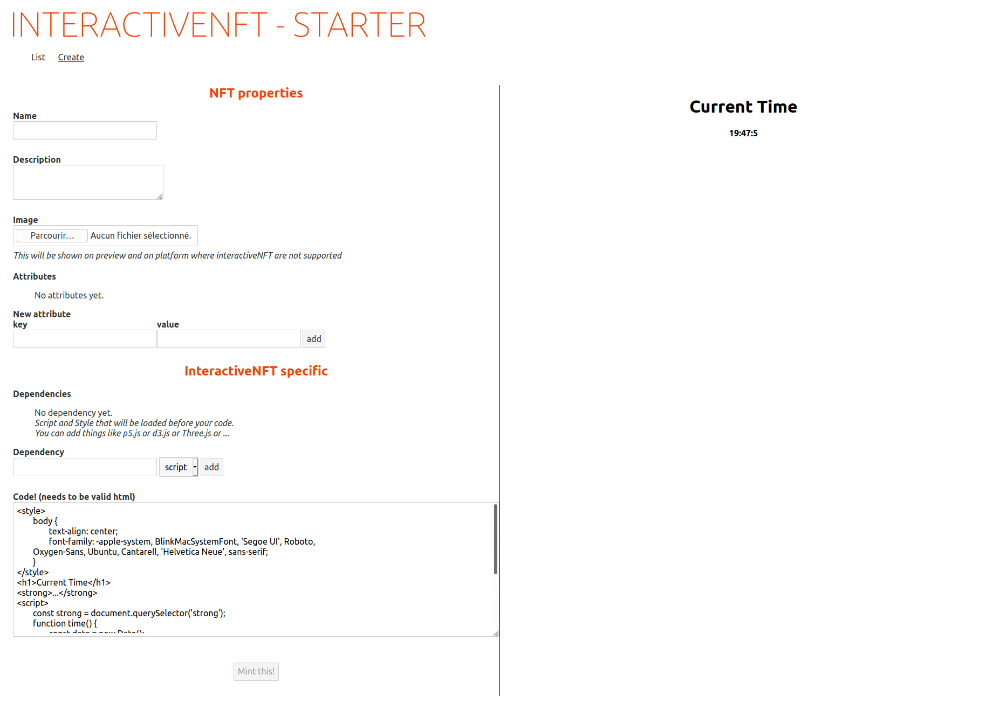

# BeyondNFT - Interactive NFT Starter

*This was developed for the Untitled NFT Hackaton while working on a safe and hopefully in the future standard way to create interactive NFTs.*

This is the "starter" project for you to be able to:

- Compile and deploy ERC721 contracts that works well with InteractiveNFT (using Truffle)
- Create and Mint Interactive NFTs on blockchain using MetaMask (mini website in [site](./site))

## Contracts

[See readme in ./truffle](./truffle/README.md)

## Site

[See readme in ./site](./site/README.md)

### List page

### Create page
